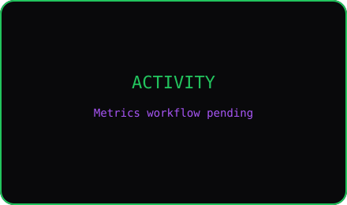

# Mateja

### Backend Developer · Belgrade, Serbia

I build useful software, pull broken systems apart, and keep digging until I understand how every piece works.

## About me

I'm a backend-focused developer who likes trying new things and building the tools I wish already existed. I enjoy problems that break, systems that need untangling, and the point where a vague idea becomes something real people can use.

I do not like stopping at “it works.” I want to understand why it works, where it fails, and how to make it dependable. Right now, my main focus is **JobTrack**, alongside smaller projects exploring developer tooling, AI-assisted products, and production web systems.

Outside code, I am usually in the gym, playing EA FC, or spending time with people.

> **Not satisfied with mediocrity.**

## What I work with

### Core

### Also in the toolbox

## Selected work

<table>
<tr>
<td width="50%" valign="top">

### [JobTrack](https://github.com/matejapp/job-track)

My main project: a production job-search workspace that replaces scattered spreadsheets, tabs, and follow-up notes.

**Highlights**

- ASP.NET Core API with layered services and repositories
- JWT authentication and strict per-user data isolation
- MongoDB Atlas, Supabase document storage, and email flows
- React, TanStack Query, typed forms, statistics, and kanban views
- Integration tests with Testcontainers, Docker, and GitHub Actions

[Live app](https://job-track.app) · [API docs](https://jobtrack-api-goyf.onrender.com/swagger)

</td>
<td width="50%" valign="top">

### [RecruitLens](https://github.com/matejapp/recruit-lens)

An AI-powered ATS simulator that explains how a resume is parsed and detects research-backed proxy-bias signals.

**Highlights**

- FastAPI backend and React/Vite frontend
- Gemini-powered analysis with actionable feedback
- Stateless resume processing with privacy-first design
- Eight explainable bias checks backed by published research

</td>
</tr>
<tr>
<td width="50%" valign="top">

### [22 Square Bar](https://github.com/matejapp/22-square-bar)

A production restaurant platform that replaced a five-year-old static site with a modern public experience and live menu management.

**Highlights**

- React, Express, MySQL, JWT, and a protected admin panel
- Real-time menu updates for nontechnical owners
- Security hardening, accessibility, SEO, and image optimization
- Deployed for an operating Serbian business

[Visit the site](https://22squarebar.com)

</td>
<td width="50%" valign="top">

### [RepoReady](https://github.com/matejapp/repo-ready)

A TypeScript and Python CLI that checks whether a developer's machine satisfies a repository's declared setup contract.

**Highlights**

- Runtime, environment, binary, port, Docker, and database checks
- Drift detection across configuration and documentation files
- Human-readable and JSON reports with CI-friendly exit codes
- Vitest, Pytest, packaging, and GitHub Actions

</td>
</tr>
</table>

## GitHub, without the vanity wall

<strong>How these metrics work</strong>

The SVG panels are generated by [lowlighter/metrics](https://github.com/lowlighter/metrics) through a scheduled GitHub Actions workflow. They cover the contribution calendar, most-used languages, coding habits, and recent public activity. When `METRICS_TOKEN` is configured with access to private repositories, private contributions can be counted without listing private repository names in the activity feed.

## A little more human

<table>
<tr>
<td width="72%" valign="middle">

- I am obsessed with training and the gym.
- I enjoy EA FC, good company, and conversations that run longer than planned.
- I am interested in backend engineering, developer tools, and games.
- I am open to employment, mentorship, and meaningful collaboration.

</td>
<td width="28%" align="center">

</td>
</tr>
</table>

### Let's build something useful—and understand every piece of it.

[Portfolio](https://pavlovicm.tech) · [LinkedIn](https://www.linkedin.com/in/matejapavlovic/) · [GitHub](https://github.com/matejapp)

